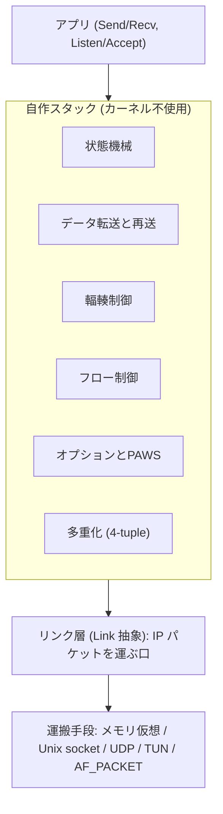

# tcp_vibe

Go の標準 `net` パッケージを使わずに TCP をゼロから実装したプロトコルスタックである。
カーネルの TCP を使わず、TCP のセグメントを自分で組み立てて解釈する。
対象環境は x86/64 の Linux である。

握手と close だけでなく、双方向のデータ転送、動的な再送タイムアウト、輻輳制御、フロー制御、主要な TCP オプションの折衝、複数接続の多重化までを備える。
ヘッダの組み立てやバイト列の変換も標準ライブラリに頼らず自前で書いている。

## 実装している機能

| 機能 | 概要 | RFC |
|---|---|---|
| 基盤 | チェックサム、IPv4/TCP ヘッダの marshal/parse、mod 2^32 の seq 比較、IPv4 パケット再分割 | 9293 |
| 状態機械 | 11 状態、3-way handshake (能動/受動/同時)、graceful close、TIME-WAIT | 9293 |
| 攻撃耐性 | blind RST/SYN/data injection への challenge ACK とレート制限 | 5961 |
| データ転送 | Send/Recv、MSS セグメント化、順不同の再組立て | 9293 |
| 動的 RTO | RTT 計測で SRTT/RTTVAR から再送タイムアウト算出、Karn | 6298 |
| 輻輳制御 | slow start / congestion avoidance / fast retransmit / fast recovery | 5681 |
| オプション折衝 | MSS、window scale (窓 64KB 超)、timestamps、SACK | 7323, 2018 |
| PAWS | timestamp で古い重複セグメントを棄却 | 7323 |
| フロー制御 | 受信窓更新 (縮めない)、zero-window probe、SWS 回避、Nagle、delayed ACK | 9293, 1122 |
| keepalive | 既定無効、設定で有効化 | 1122 |
| 多重化 | 4-tuple で接続識別、Listener/Accept で複数同時接続 | 9293 |
| NAT 越え | UDP hole punching でランデブー経由の直接 UDP 確立 | - |

## アーキテクチャ概観

アプリの下に自作スタックがあり、その下のリンク層が IP パケットを運ぶ口になる。
TCP のロジックはどのリンクでも変わらず自作スタックが処理し、リンク層から下だけがカーネルへの依存の度合いで分かれる。



リンク層の種類とカーネルへの依存の度合いは [docs/networking.md](docs/networking.md) に集約している。

## クイックスタート

aqua で Go を固定し、justfile のレシピを `just <レシピ名>` で実行する。
aqua 本体だけは事前に PATH に通しておく。

```sh
just setup          # aqua で Go と just を取得
just build          # ビルド
just e2e            # 2 プロセスを土管越しに起動し、握手からデータ転送、close まで検証
```

特権の要らない UDP トンネルまたは Unix domain socket を使えば、root のない環境でも別プロセス間の実通信を確かめられる。
リンクごとの起動手順は [docs/usage.md](docs/usage.md) にある。

## ドキュメント

- [docs/architecture.md](docs/architecture.md)：レイヤとファイル構成、状態遷移図、パケット送受信フロー。
- [docs/networking.md](docs/networking.md)：リンク層 5 種の比較と選び方、UDP hole punching による NAT 越え。
- [docs/usage.md](docs/usage.md)：ビルドとテスト、リンク別の起動手順、e2e テスト、TIME-WAIT の待ち時間。

## 制約と前提

- SACK は受信側でブロックを広告するところまでで、送信側で SACK 済みの範囲を飛ばす選択的再送は実装していない。
- AF_PACKET は同一 L2 セグメント上での通信を前提とし、gateway を越える解決や proxy ARP は扱わない。
- UDP hole punching は cone 系 NAT には効くが、対称 NAT には効きにくい (リレーは無い)。
- 状態遷移とプロトコルの正しさを主眼としており、転送性能の最適化やバッファ管理の作り込みは限定的である。
