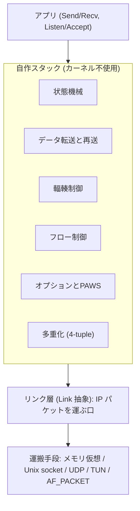

# tcp_vibe

Go の標準 `net` パッケージを使わずに、TCP をゼロから実装したプロトコルスタックである。
RFC 9293 の状態機械と RFC 5961 の対策を中心に、握手と close だけでなく、双方向のデータ転送、動的な再送タイムアウト、輻輳制御、フロー制御、主要な TCP オプションの折衝、複数接続の多重化までを備える。
ヘッダの組み立てやバイト列の変換も標準ライブラリに頼らず自前で書いている。

対象環境は x86/64 の Linux である。

## 何を自作しているか

このスタックは、カーネルの TCP を使わず、TCP のセグメントを自分で組み立てて解釈する。
IP より下をどこまで自作するかはリンク層によって変わる。
AF_PACKET なら IP も ARP もこのスタックが組み、カーネルは NIC への生バイト I/O だけを担う。
TUN なら TCP はこのスタックが処理するが、IP パケットの配送はカーネルの L3 に任せる。
いずれの場合も、TCP の状態遷移とセグメント処理を書くことを主眼に置いているため、ソケット API も標準の `encoding/binary` も使わず、部品を下から積み上げている。

レイヤ構造は次のとおりである。
状態機械からフロー制御までを自作スタックが担い、その下のリンク層でカーネルへの依存の度合いが分かれる。



運搬手段はカーネルへの依存の度合いが揃っていない。
メモリ仮想と Unix domain socket と UDP はバイトを運ぶだけで TCP/IP のロジックを通さず、AF_PACKET も NIC への生バイト出力だけをカーネルに任せて IP も ARP も自作する。
これに対して TUN は IP パケットの配送をカーネルの L3 に任せる点だけが異なる。
詳しい区別は [docs/architecture.md](docs/architecture.md) の表にまとめている。

実装している機能は次のとおりである。

- 基盤：チェックサム (擬似ヘッダ込み)、IPv4 と TCP のヘッダの marshal/parse、mod 2^32 のシーケンス番号比較、バイトストリームからの IPv4 パケット再分割。
- 状態機械：11 状態の遷移、3-way handshake (能動オープン、受動オープン、同時オープン)、graceful close、TIME-WAIT。
- RFC 5961：blind RST、blind SYN、blind data injection への challenge ACK と、その送出のレート制限。
- データ転送：Send と Recv による双方向のやり取り。送信は MSS 単位にセグメント化し、受信は順不同で届いたセグメントを再組立てしてストリームに戻す。
- 動的 RTO (RFC 6298)：RTT を測って SRTT と RTTVAR から再送タイムアウトを算出する。再送したセグメントは RTT 標本に使わない (Karn のアルゴリズム)。
- 輻輳制御 (RFC 5681)：slow start、congestion avoidance、fast retransmit、fast recovery を cwnd と ssthresh で調整する。
- オプション折衝 (RFC 7323、RFC 2018)：MSS、window scale、timestamps、SACK を握手時に折衝する。window scale により受信窓を 64KB 超に広げられる。
- PAWS (RFC 7323)：timestamp を見て、巻き戻った古い重複セグメントを棄却する。
- フロー制御 (RFC 9293、RFC 1122)：受信窓の動的な更新 (窓は縮めない)、zero-window probe、silly window syndrome の回避、Nagle アルゴリズムと delayed ACK。
- keepalive (RFC 1122)：既定では無効で、設定で有効にできる。
- 多重化：接続を 4-tuple で識別し、Listener と Accept で複数の接続を同時に扱う。
- リンク層：IP パケットを運ぶ口を差し替えられる。テスト用のメモリ仮想リンク、特権の要らない Unix domain socket と UDP トンネル、実機用の TUN と AF_PACKET を揃える。TUN は IP の配送をカーネルの L3 に任せ、AF_PACKET は IP も ARP (RFC 826) も自作スタックで組む。

これらの挙動はテストで検証している。

## 使い方

aqua で Go を固定し、justfile のレシピを `just <レシピ名>` で実行する。
aqua 本体だけは事前に PATH に通しておく。

```sh
just setup          # aqua で Go と just を取得
just build          # ビルド
just check          # 静的解析、整形チェック、race 検出付きテストを通す
```

特権の要らない Unix domain socket または UDP トンネルを使えば、root のない環境でも別プロセス間の実通信を確かめられる。
2 プロセスを起動する手順は `just e2e` で自動化している。

```sh
just e2e            # 2 プロセスを土管越しに起動し握手からデータ転送、close までを検証
```

## ドキュメント

- [docs/architecture.md](docs/architecture.md)：ファイル構成と、リンク層の選び方 (カーネルへの依存の度合い)。
- [docs/usage.md](docs/usage.md)：デモの動かし方、e2e テスト、TUN を使う実機での実通信手順、TIME-WAIT の待ち時間。

## 制約と前提

実通信を行う構成には、いくつかの限定がある。

- TUN と AF_PACKET はカーネルに依存し、root (AF_PACKET は CAP_NET_RAW) が要る。依存の度合いは異なり、TUN は IP の配送をカーネルに任せる L3 デバイス、AF_PACKET は同一 L2 セグメント上で IP も ARP も自作する手段である。Unix domain socket と UDP トンネルは特権を要さない。
- AF_PACKET ドライバは Ethernet フレームの組み立てと ARP を自作スタックで行うが、同一 L2 セグメント上での通信を前提とし、gateway を越える解決や proxy ARP、gratuitous ARP は扱わない。
- SACK は受信側でブロックを広告するところまでで、送信側で SACK 済みの範囲を飛ばす選択的再送は実装していない。
- 状態遷移とプロトコルの正しさを主眼としており、転送性能の最適化やバッファ管理の作り込みは限定的である。
