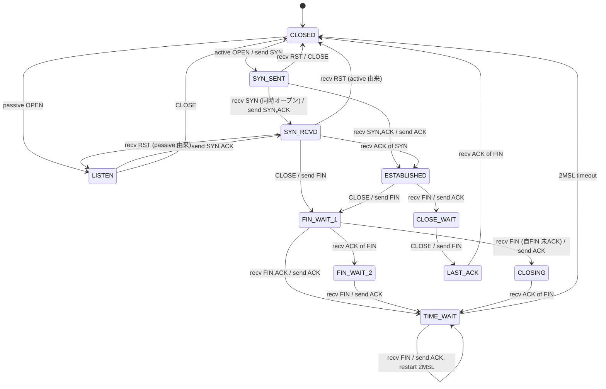
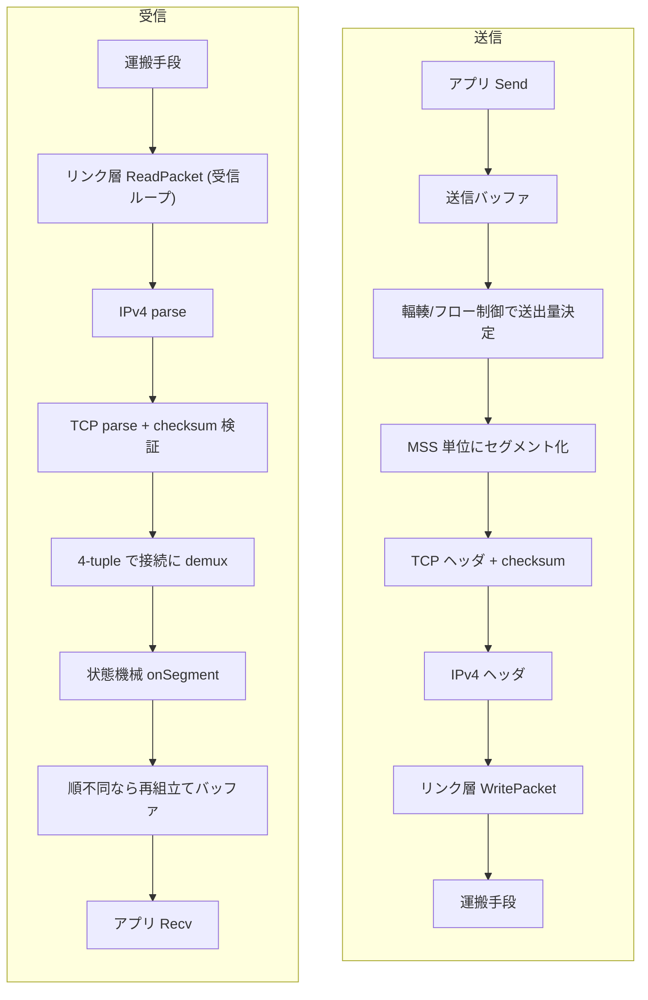

# 構成

自作スタックのレイヤとファイル構成、状態遷移、パケット送受信フローを説明する。
リンク層の種類と選び方は [networking.md](networking.md) にまとめている。

実装は `tcp/` 配下を三つのパッケージに分けている。
依存は一方向で、上の層が下の層を参照する。

| パッケージ | 層 | 役割 |
|---|---|---|
| `tcp/network` | ネットワーク層 | IPv4 ヘッダ、チェックサム、バイトオーダ変換 |
| `tcp/link` | リンク層 | IP パケットを運ぶ Link の抽象と実装 (pipe/unix/udp/tun/afpacket、ARP、hole punching) |
| `tcp/transport` | トランスポート層 | TCP 本体。状態機械、データ転送、輻輳・フロー制御、多重化 |

依存の向きは `transport → link → network` および `transport → network` で、逆流はない。
`network` はどの層も参照せず、`link` は `network` だけを参照する。

## ネットワーク層 (`tcp/network`)

| ファイル | 役割 |
|---|---|
| `checksum.go` | 擬似ヘッダ込みのチェックサム計算 |
| `bytes.go` | ビッグエンディアン変換 |
| `ipv4.go` | IPv4 ヘッダの marshal/parse とセグメント切り出し |

## トランスポート層の部品 (`tcp/transport`)

下位の純粋な部品から並べる。

| ファイル | 役割 |
|---|---|
| `seq.go` | シーケンス番号の mod 2^32 環状算術 |
| `header.go` | TCP ヘッダの marshal/parse |
| `options.go` | TCP オプションの marshal/parse と折衝 |
| `framing.go` | バイトストリームからの IPv4 パケット再分割 |

## 状態機械とデータ転送

| ファイル | 役割 |
|---|---|
| `tcb.go` | 状態定義と接続ごとの制御ブロック |
| `statemachine.go` | TCP 状態機械。11 状態の遷移、RFC 5961 の challenge ACK、セグメント処理 |
| `data.go` | Send/Recv によるデータの送受信、ユーザバッファの管理、順不同セグメントの再組立て |
| `rto.go` | RTT 計測にもとづく動的 RTO の算出 |
| `congestion.go` | cwnd と ssthresh による輻輳制御 |
| `flowcontrol.go` | 受信窓の更新、zero-window probe、SWS 回避、Nagle、delayed ACK |
| `paws.go` | timestamp による古い重複セグメントの棄却 |
| `sack.go` | 受信側の SACK ブロックの生成 |
| `keepalive.go` | keepalive プローブ |

## 多重化と受信ループ

| ファイル | 役割 |
|---|---|
| `conntable.go` | 4-tuple で接続を引く接続テーブル |
| `listener.go` | Listener と、接続を多重化する Stack |
| `recvloop.go` | 受信ループと、接続を駆動する Serve ヘルパ |

## 状態遷移

`statemachine.go` が扱う 11 状態の遷移を示す。
能動オープンから close までの主経路は CLOSED から SYN_SENT、ESTABLISHED、FIN_WAIT_1、FIN_WAIT_2、TIME_WAIT を経て CLOSED に戻る。
受動側の主経路は LISTEN から SYN_RCVD、ESTABLISHED、CLOSE_WAIT、LAST_ACK を経て CLOSED に戻る。
エッジのラベルは「受け取ったイベント / 送るアクション」を表す。

## パケットの送受信フロー

送信はアプリの Send を起点に、輻輳制御とフロー制御で送出量を決め、MSS 単位のセグメントに TCP ヘッダと IPv4 ヘッダを被せてリンク層へ渡す。
受信はリンク層から読んだバイト列を IPv4 と TCP として解釈し、checksum を検証し、4-tuple で接続に振り分けてから状態機械に渡す。

## リンク層

リンク層 (Link) は IP パケットを運ぶ口で、差し替えられる。
TCP のロジックそのものはどのリンクでも変わらず自作スタックが処理し、違うのはパケットを運ぶ手段だけである。
リンク層 5 種の比較、カーネル依存の度合い、選び方、NAT 越えは [networking.md](networking.md) に集約している。
