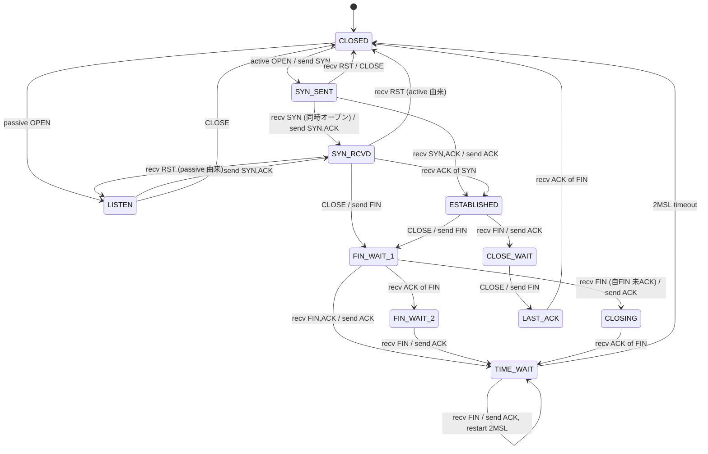
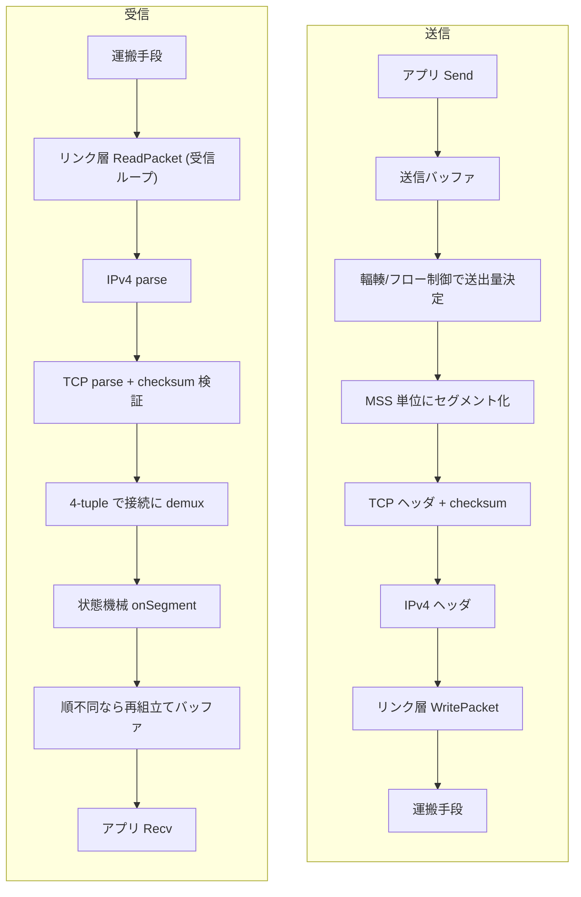

# 構成

実装は `tcp/` 配下にある。
プロトコルのロジックを下から積み上げ、その上に状態機械、さらに上に多重化と運搬層の抽象を置く構造になっている。

## 部品

下位の純粋な部品から並べる。

- `seq.go`：シーケンス番号の mod 2^32 環状算術。
- `checksum.go`：擬似ヘッダ込みのチェックサム計算。
- `bytes.go`：ビッグエンディアン変換。
- `ipv4.go`：IPv4 ヘッダの marshal/parse。
- `header.go`：TCP ヘッダの marshal/parse。
- `options.go`：TCP オプションの marshal/parse と折衝。
- `framing.go`：バイトストリームからの IPv4 パケット再分割。

## 状態機械とデータ転送

- `tcb.go`：状態定義と接続ごとの制御ブロック。
- `statemachine.go`：TCP 状態機械。11 状態の遷移、RFC 5961 の challenge ACK、セグメント処理。
- `data.go`：Send と Recv によるデータの送受信、ユーザバッファの管理、順不同セグメントの再組立て。
- `rto.go`：RTT 計測にもとづく動的 RTO の算出。
- `congestion.go`：cwnd と ssthresh による輻輳制御。
- `flowcontrol.go`：受信窓の更新、zero-window probe、silly window syndrome の回避、Nagle と delayed ACK。
- `paws.go`：timestamp による古い重複セグメントの棄却。
- `sack.go`：受信側の SACK ブロックの生成。
- `keepalive.go`：keepalive プローブ。

## 状態遷移

`statemachine.go` が扱う 11 状態の遷移を示す。
能動オープンから close までの主経路は CLOSED から SYN_SENT、ESTABLISHED、FIN_WAIT_1、FIN_WAIT_2、TIME_WAIT を経て CLOSED に戻る。
受動側の主経路は LISTEN から SYN_RCVD、ESTABLISHED、CLOSE_WAIT、LAST_ACK を経て CLOSED に戻る。
エッジのラベルは「受け取ったイベント / 送るアクション」を表す。

## 多重化と受信ループ

- `conntable.go`：4-tuple で接続を引く接続テーブル。
- `listener.go`：Listener と、接続を多重化する Stack。
- `recvloop.go`：受信ループと、接続を駆動する Serve ヘルパ。

## パケットの送受信フロー

送信はアプリの Send を起点に、輻輳制御とフロー制御で送出量を決め、MSS 単位のセグメントに TCP ヘッダと IPv4 ヘッダを被せてリンク層へ渡す。
受信はリンク層から読んだバイト列を IPv4 と TCP として解釈し、checksum を検証し、4-tuple で接続に振り分けてから状態機械に渡す。

## リンク層

リンク層 (Link) は IP パケットを運ぶ口で、差し替えられる。
カーネルへの依存の度合いが異なる実装を揃えている。

- `link.go`：リンク層の抽象 (Link) と、テスト用のメモリ仮想リンク。
- `unixlink.go`：Unix domain socket を IP パケットの土管として使う。
- `udplink.go`：UDP ソケットを IP パケットの土管として使う。
- `tun_linux.go`：実機用の TUN ドライバ (L3、IP パケットを直接やり取り)。
- `arp.go`：ARP (RFC 826) の自作。IP から MAC をカーネルに頼らず解決する。
- `afpacket_linux.go`：実機用の AF_PACKET ドライバ。ARP も自作スタックで解決する (L2)。

`cmd/tcpdemo` は、TUN、UDP トンネル、Unix domain socket のいずれか越しに握手と close を実演するデモである。

## リンク層の選び方

リンク層は、カーネルのネットワーク機能をどこまで使うかで選ぶ。
TCP のロジックそのものはどのリンクでも変わらず自作スタックが処理し、違うのはパケットを運ぶ手段だけである。

| リンク | パケットを運ぶ手段 | カーネルのプロトコル処理 | 必要な特権 | 用途 |
|---|---|---|---|---|
| メモリ仮想リンク | プロセス内のメモリ | 使わない | 不要 | テスト、同一プロセス内 |
| Unix domain socket | AF_UNIX のデータグラム | 通さない (バイト土管) | 不要 | 別プロセス間、同一ホスト |
| UDP トンネル | UDP データグラム | UDP と IP を借りる | 不要 | 別プロセス間、別ホスト可 |
| TUN | カーネルの TUN デバイス (L3) | IP より上は通さない | root | 実機 |
| AF_PACKET | NIC への raw バイト I/O (L2) | 使わない (Ethernet/IP/ARP を自作) | CAP_NET_RAW | 実機 |

メモリ仮想リンクと AF_PACKET は、カーネルのネットワークプロトコルを一切通さない。
前者はプロセス内に閉じ、後者は NIC への生バイト出力だけをカーネルに任せて Ethernet と IP と ARP を自作スタックが組む。
Unix domain socket と UDP トンネルは、運搬の土管だけカーネルを借り、TCP/IP のロジックは通さない。
特権が要らないため、root のない環境でも別プロセス間の実通信を確かめられる。
