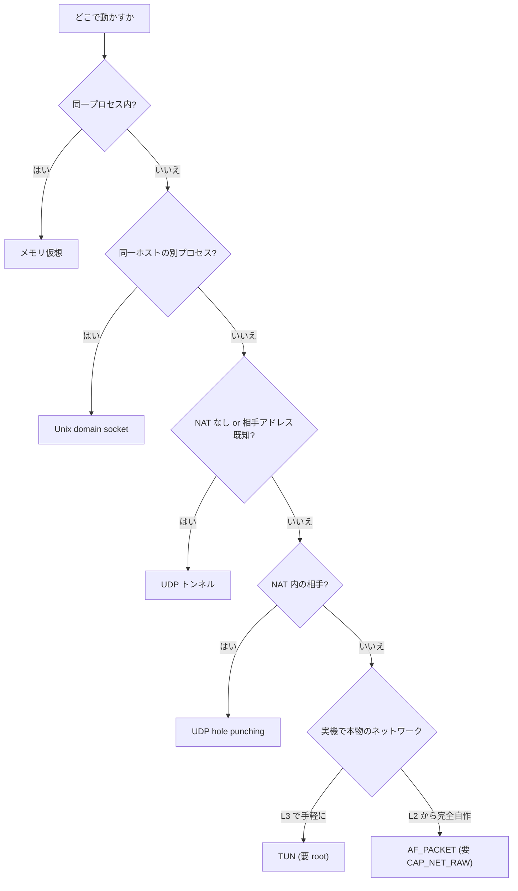
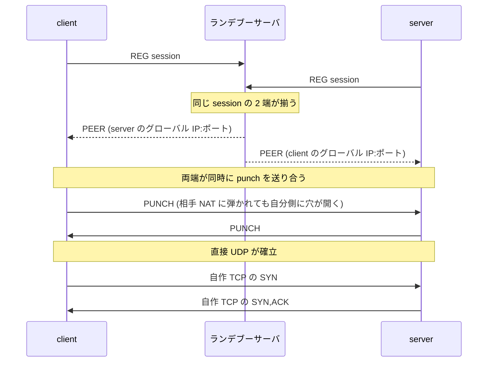

# リンク層と NAT 越え

IP パケットを運ぶリンク層 5 種の違いと選び方、UDP hole punching による NAT 越えを説明する。
自作スタックの全体構成は [architecture.md](architecture.md) を参照。

リンク層 (Link) は IP パケットを運ぶ口である。
TCP のロジックはどのリンクでも変わらず自作スタックが処理し、違うのはパケットを運ぶ手段と、そこでカーネルをどこまで使うかである。

## リンク層 5 種の比較

| リンク | 運搬手段 | カーネルのプロトコル処理 | 必要な特権 | 主な用途 |
|---|---|---|---|---|
| メモリ仮想 | プロセス内のメモリ | 使わない | 不要 | テスト、同一プロセス内 |
| Unix domain socket | AF_UNIX データグラム | 通さない (バイト土管) | 不要 | 同一ホストの別プロセス間 |
| UDP トンネル | UDP データグラム | UDP と IP を借りる | 不要 | 別ホスト、アドレス既知 or NAT なし |
| TUN | カーネルの TUN デバイス (L3) | IP の配送はカーネル (TCP は通さない) | root | 実機で手軽に L3 接続 |
| AF_PACKET | NIC への raw バイト I/O (L2) | 使わない (Ethernet/IP/ARP を自作) | CAP_NET_RAW | 実機で完全自作、同一 L2 |

NAT 越えは UDP トンネルを hole punching で確立する応用である。

## カーネル依存の 3 段階

リンク層は、カーネルのネットワークプロトコルをどこまで通すかで 3 段階に分かれる。

- **プロトコルを一切通さない**：メモリ仮想と AF_PACKET。前者はプロセス内に閉じ、後者は NIC への生バイト出力だけをカーネルに任せ、Ethernet と IP と ARP を自作スタックが組む。
- **運搬の土管だけ借りる**：Unix domain socket と UDP トンネル。自作スタックが組んだ IP パケットをペイロードとして運ぶだけで、TCP/IP のロジックは通さない。特権が要らず、root のない環境でも別プロセス間の実通信を確かめられる。
- **IP 層を借りる**：TUN。TCP は自作スタックが処理する一方、IP パケットの配送はカーネルの L3 に任せる。IP より下を自分で組まずに実機の本物のネットワークへ L3 で出せるため手軽だが、IP 層はカーネルが受け持つ。

## リンク層の選び方

## NAT 越え (UDP hole punching)

NAT 内の 2 端は、互いの「NAT 通過後に外から見えるグローバル IP:ポート」を直接は知れない。
そこでランデブーサーバ (STUN ライク) を足場に、両端が自分のグローバルアドレスを学習し、同時に punch パケットを送り合って NAT のマッピングを開ける。

ランデブーサーバは各登録パケットの送信元アドレス (NAT 通過後にサーバから見えたグローバルアドレス) を記録し、2 端が揃った時点で互いのアドレスを相手へ返す。
アドレスを変換するのは NAT であり、サーバは「どう見えたか」を教えるだけである。

これは WireGuard や WebRTC と同じ型の NAT 越えである。
自作 TCP を UDP の土管に包んでいるため、UDP として NAT を通り、確立した土管の上で自作 TCP が握手する。

### 限界

- cone 系 NAT (full-cone / restricted-cone / port-restricted) には効くが、対称 NAT (宛先ごとに別ポートを割り当てる NAT) では相手から見えるポートを事前に予測できず効きにくい。TURN 的なリレーは無い。
- localhost での検証は NAT が無いため、手順が正しく流れることの実証であり、実 NAT の通過可否は環境に依存する。
