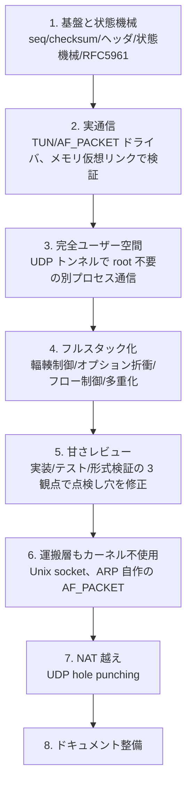
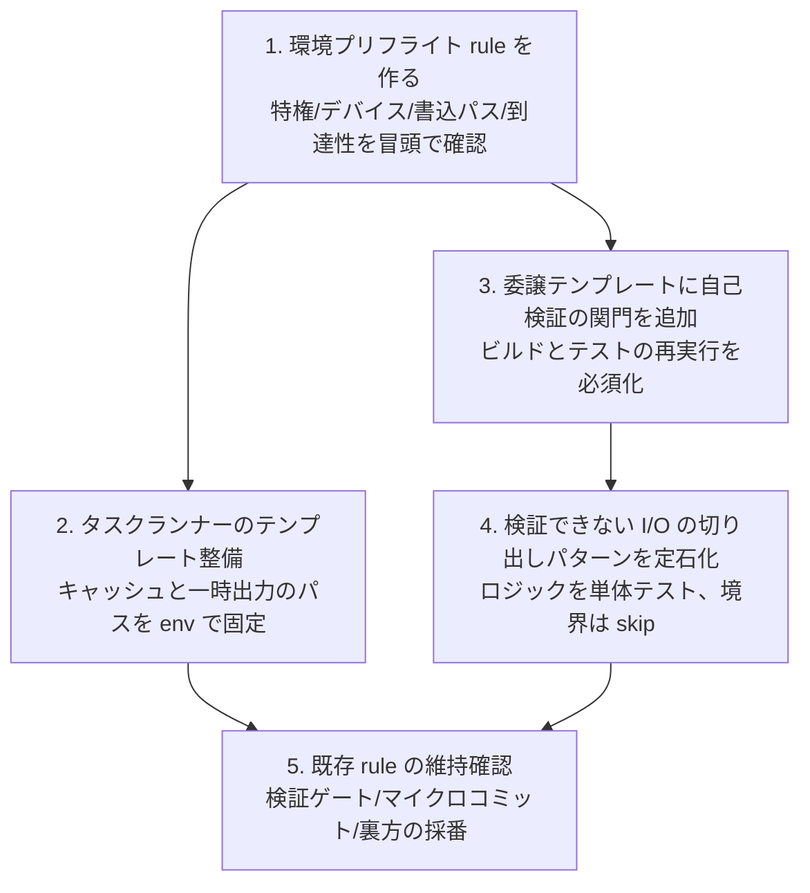

# 統合レトロスペクティブ: 自作 TCP プロトコルスタック

このドキュメントは、tcp_vibe プロジェクト全体の振り返りを 1 つにまとめたものである。
読み手はネットワークの基礎知識があるソフトウェアエンジニアを想定する。
最初は「net.Conn の上の最小フレーミング」を想定して始まったが、最終的に標準 `net` を使わない TCP/IP スタックの自作、実通信、完全ユーザー空間化、フルスタック化、NAT 越えまで到達した。

後半に「別セッションで dotfiles の改善に使う」ための節を置く。
そこに、開発で使った手法 (rule) が実戦でどう効き、どこで摩擦が出たか、どう直すかを具体的にまとめた。

## 1. 何を作ったか

- 標準 `net` パッケージを使わない TCP/IP スタック。`encoding/binary` も自作。
- 準拠する RFC: 9293 (TCP), 5961 (攻撃耐性), 5681 (輻輳制御), 6298 (RTO), 7323 (window scale/timestamps/PAWS), 2018 (SACK), 1122 (host requirements), 826 (ARP)。
- 規模: 55 コミット、本体 約 4,600 行、テストと fuzz が 263 関数。
- 検証: `just check` (静的解析 + 整形チェック + race 付きテスト 5 回) と `just e2e` が全て通る。

備えている機能を層ごとに示す。

| 層 | 機能 |
|---|---|
| 基盤 | チェックサム、IPv4/TCP ヘッダの marshal/parse、mod 2^32 の seq 比較、IPv4 パケット再分割 |
| 接続 | 11 状態の状態機械、3-way handshake (能動/受動/同時)、graceful close、TIME-WAIT |
| 攻撃耐性 | blind RST/SYN/data injection への challenge ACK とレート制限 |
| 転送 | Send/Recv、MSS セグメント化、順不同の再組立て、動的 RTO、輻輳制御 |
| 窓 | window scale (64KB 超)、フロー制御 (zero-window probe、SWS 回避、Nagle、delayed ACK)、PAWS |
| 多重化 | 4-tuple で接続識別、Listener/Accept、複数同時接続 |
| 運搬 | メモリ仮想、Unix socket、UDP トンネル、TUN、AF_PACKET (ARP 自作)、UDP hole punching |

## 2. 開発フェーズの流れ

スコープが段階的に広がった。各フェーズで「動く」を一段ずつ引き上げた。

各フェーズで共通して回した手順は次のとおりである。

1. 必要なら IETF から RFC を取得し、要件を採番して台帳にする。
2. 状態遷移や並行が絡むなら設計を検査し、数学的性質が要るなら証明する。
3. 検証で固めた境界を 1 対 1 でテストに落とし、TDD で実装する。
4. agent の報告を鵜呑みにせず、自分でビルドとテストを再実行して確認する。
5. 論理単位ごとに小さくコミットする。

## 3. 検証三層が何を捕まえたか

設計の検査、実装の証明、テストによる駆動を役割で使い分けた。
机上の検査が、実装で見落としやすい穴を先回りで捕まえた。

### 設計の検査 (状態遷移と並行)

| 対象 | 状態数 | 見つけた穴 |
|---|---|---|
| 状態機械 | 520 | リセットの根拠を縛れていない、同時オープンの由来を取り違える |
| 輻輳制御 | 949 | 損失時の ssthresh を初回だけ半減し再送中は保つ規則の取りこぼし |
| 多重化 | 27,211 | 接続テーブルへの挿入が不可分でないと同じ 4-tuple に二重登録される |
| フロー制御 | 約 102 万 | Nagle と delayed ACK が互いに待ち合うデッドロック |

いずれも変異検査 (spec をわざと壊して検査が気付くか試す) で穴を確定させ、対応する不変条件を足してから実装テストに配線した。

### 実装の証明 (数学的性質)

整数演算や環状空間の性質を証明し、テストでは届きにくい領域を固めた。

- seq の mod 2^32 比較: 対蹠点 (距離がちょうど 2^31) で順序が定まらないことを発見。実装は窓を 2^31 未満に保って回避しており、その前提を証明とテストで固定した。
- RTO の計算: RTT の標本が有界なら推定値が発散しないこと、下限とバックオフの単調性を証明。整数で実装すべきと判明 (浮動小数だと証明と乖離する)。
- 順不同の再組立て: 任意の到着順と重複でも元のバイト列に戻ることを証明。
- 輻輳ウィンドウの増加則: slow start と congestion avoidance の増分が上限を超えないこと。

### テストによる駆動

各不変条件と証明済みの性質を、境界値テストと、入力をランダムに振って性質を確かめるテストに 1 対 1 で対応づけた。
パーサには fuzz を置き、境界外参照を安く潰した。

## 4. 机上では出ず、実通信で踏んだバグ

実際にパケットを流して初めて出たバグがある。
メモリ上の検査だけでは再現しなかった。

| バグ | 症状 | 原因 |
|---|---|---|
| 非 IPv4 で受信ループ停止 | 握手が進まない | TUN に IPv6 が流れ、再分割器が致命扱いしてループを止めた |
| 受信窓が未広告 | FIN が弾かれる | 受信窓を広告しておらず受理性テストで落ちた |
| TIME-WAIT が 1MSL | 仕様違反 | 2MSL であるべき定数を取り違えた |
| TCP チェックサム未検証 | 改竄を見逃す | 受信経路で IPv4 のヘッダしか検証していなかった |
| 同じローカルポートで衝突 | hole punch が失敗 | デモの両端が同じポートを使っていた |

レビューでさらに見つけた実装の穴も修正した。
握手が中途半端な ACK で成立してしまう問題、受信窓が 64KB を超えると壊れる問題、接続が閉じてもテーブルから回収されず再利用できない問題などである。

## 5. うまくいったこと

- **検査を着手前に決めた**。状態遷移や並行があるか、数学的性質が要るかを実装前に判断した。実装ファーストに流れなかったことで、後から検証層を足すより安く穴を塞げた。
- **並列で進めた**。RFC の抽出、設計の検査、証明をバックグラウンドで並走させ、それらと独立に書ける純粋な部品 (seq、checksum、ヘッダ) を先に実装して待ち時間を消した。
- **変異検査が本物の穴を出した**。検査を通すだけでなく、spec をわざと壊して検査が気付くか試したことで、不変条件が「遷移先」しか縛れておらず「根拠」や「値」を見ていない穴が露見した。
- **agent の報告を自分で再検証した**。報告が「全て緑」でも、自分でビルドとテストを回し直した。2MSL バグやチェックサム漏れはこの再検証で見つかった。
- **3 観点の独立レビューが裏を取った**。実装の正しさ、テスト設計、形式検証を別々に点検し、複数観点が同じ穴を指摘したことで優先度が明確になった。
- **小さくコミットした**。55 コミットすべて論理単位で、後から履歴を辿りやすい。

## 6. 詰まったこと (主に環境)

- **サンドボックスに特権がない**。raw socket も TUN も開けず、当初の AF_PACKET 案が実行できなかった。メモリ仮想リンクと UDP トンネルへ方針を切り替えた。Unix socket は `socket(AF_UNIX)` 自体が拒否され、socketpair でのみ検証できた。
- **ファイルシステムが読み取り専用の箇所がある**。ビルドキャッシュを repo 内に向け、npm でのツール取得は諦めた。
- **ツールの初回起動でつまずいた**。パッケージマネージャのプロキシが初回に設定を見つけられず失敗した。最初はラッパで回避したが、後にタスクランナーを直接呼べば足りると分かり、ラッパは消した。
- **agent が報告生成中に 1 度落ちた**。実装は完了していたが最終確認が残り、自分で補完した。

これらはプロジェクト固有というより、隔離環境で開発するときに繰り返し当たる種類の問題である。
次の節の dotfiles 改善は、ここで得た教訓を仕組みに落とすことを狙う。

## 7. dotfiles 改善への示唆

このプロジェクトは、dotfiles の rule 群 (作業の進め方、ループエンジニアリング、形式検証、最小実装、マイクロコミットなど) を実戦投入する場でもあった。
rule ごとに、効いた点と摩擦、改善案を示す。

### 7.1 効いた rule (維持)

| rule | 効いた点 |
|---|---|
| 検証ゲートを着手前に通す | 状態遷移と並行を持つ領域で、実装前に検査層を決めたことが穴の先回りに直結した |
| 設計の検査と実装の証明を役割分担 | 状態遷移は設計の検査、環状演算や数値の健全性は証明、と切り分けて二重作業を避けた |
| agent への委譲と自己再検証 | 重い検査と探索を委譲しつつ、報告を鵜呑みにせず自分で確かめる流れがバグを捕まえた |
| マイクロコミット | 55 コミットが論理単位で、レビューと履歴追跡が容易だった |
| 管理番号と手法用語を裏方に閉じる | 検証由来の採番をソースやコミットに漏らさず、本体は手法を知らない人が読める状態を保てた |
| 最小実装 (YAGNI) | 未使用 API の削除、SACK 送信側の選択再送を範囲外と明示するなど、過剰実装を抑えた |

### 7.2 摩擦が出た点と改善案

隔離環境で繰り返し当たった問題を、rule やテンプレートに落とすと次回が楽になる。

- **環境前提の確認を最初の手順に入れる**
  - 問題: 特権 (CAP_NET_RAW)、デバイス (/dev/net/tun)、書き込み可能パス、ネットワーク到達性を、着手後に発見して方針転換した。
  - 改善: 「環境の能力を最初に探る」チェックを作業開始の定型にする。必要な特権やデバイスの有無、書き込み可能ディレクトリ、外部到達性を冒頭で確認し、無い場合の代替 (メモリ仮想、UDP トンネル) を先に決める。
- **ビルドキャッシュと一時ファイルの置き場を最初に固定する**
  - 問題: `~/.cache` や `~/.npm` が読み取り専用で、ツールが既定の場所に書こうとして失敗した。
  - 改善: タスクランナーのテンプレートで、キャッシュと一時出力を repo 内かサンドボックス書き込み可能パスに向ける環境変数を最初から export しておく。
- **タスクランナーは余計なラッパを足さず素直に呼ぶ**
  - 問題: パッケージマネージャのプロキシ問題を回避するためにラッパを作ったが、環境変数をタスクランナー側で export すれば不要だった。
  - 改善: ラッパを足す前に「環境変数の固定で済まないか」を確認する一手を挟む。最小の構成から始める。
- **agent の報告には必ず自己検証の関門を置く**
  - 問題: agent が完了報告を出しても、最終確認が抜けたり報告生成中に落ちたりした。
  - 改善: 委譲のテンプレートに「成果物を自分でビルドとテストし、報告と一致するか確認してから次へ進む」を明記する。すでに方針としてあるが、関門として手順化すると漏れない。
- **隔離環境で検証できない部分の扱いを定型化する**
  - 問題: 実 NAT、実 NIC、特権が要る通信は、このサンドボックスで実行検証できなかった。
  - 改善: 「実行検証できない範囲は、ロジックを単体テスト可能に切り出し、I/O 境界だけ skip する」パターンをテンプレ化する。今回 ARP の応答ロジックや hole punch の手順を、ソケットなしで叩ける関数に切り出して検証した。この切り出し方を定石にする。

### 7.3 dotfiles 改善の実装の流れ

別セッションで dotfiles を改善するときの進め方を、依存順で示す。

着手の順番は次のとおりである。

1. **環境プリフライト** を最初に作る。これが他の改善の土台になり、隔離環境での方針転換を減らす。
2. **タスクランナーのテンプレート** を整える。キャッシュと一時出力の置き場を環境変数で固定し、ラッパを足さずに済む形にする。
3. **委譲テンプレート** に自己検証の関門を足す。agent の報告とコードの実態がずれないようにする。
4. **検証できない I/O の切り出しパターン** を定石にする。ロジックを単体テスト可能にし、実行できない境界だけ skip する書き方をテンプレに残す。
5. 効いている既存 rule (検証ゲート、マイクロコミット、裏方の採番) は変えずに維持する。

## 8. トレーサビリティ

主要な領域について、設計の検査と証明、テスト、実装、コミットの対応を示す。

| 領域 | 設計の検査 / 証明 | 実装 | 代表コミット |
|---|---|---|---|
| seq 比較 | 証明 (環状順序) | seq.go | 9052903, d56e18e |
| checksum | 証明 (往復健全性) | checksum.go | dd352f0, f86df83 |
| 状態機械 | 検査 (520 状態) | statemachine.go, tcb.go | 6bd4f00, 1be5443 |
| 攻撃耐性 | 検査 (状態機械に内包) | statemachine.go | 1be5443, 5a18ac0 |
| データ転送 | 証明 (再組立て) | data.go | 43f6cfb, d56e18e |
| 動的 RTO | 証明 (非発散/単調) | rto.go | 0c28a49, d56e18e |
| 輻輳制御 | 検査 (949 状態) + 証明 (増加則) | congestion.go | 0c28a49, d56e18e |
| オプション/PAWS | 証明 (clamp/単調) | options.go, paws.go | 17764ac, 292457a |
| フロー制御 | 検査 (102 万状態) | flowcontrol.go | cf4a3a5 |
| 多重化 | 検査 (27,211 状態) | conntable.go, listener.go | d4b71a2 |
| NAT 越え | 単体テスト + localhost 実証 | holepunch.go, rendezvous.go | 9343420 |

## 9. 残課題

- SACK の送信側の選択的再送 (受信側のブロック広告までは実装済み)。
- カーネルの TCP (nc, curl など) との相互運用テスト。
- AF_PACKET の gateway 越えと、対称 NAT への対応 (リレーが要る)。
- 転送性能の最適化とバッファ管理の作り込み。
- 実機 (root, 実 NIC, 実 NAT) での通信検証。隔離環境では手順の実証までにとどまる。

検証の中間成果物 (設計の spec、証明、要件台帳、受け入れ仕様) は `tasks/` 配下に置き、git では tasks/ のソースを追跡しビルド生成物だけ除外している。
管理番号と手法用語は tasks/ の中だけで閉じ、本体ソースとコミットと README には漏らしていない。
